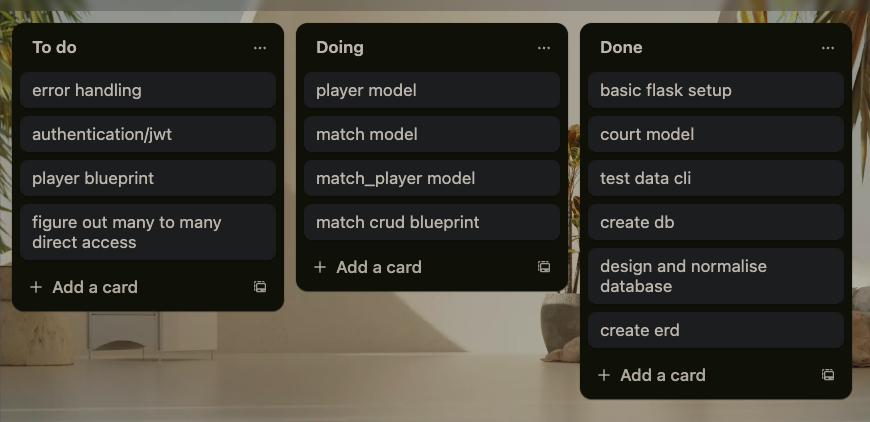
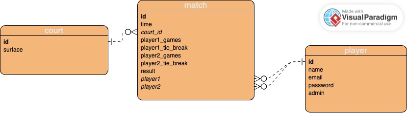
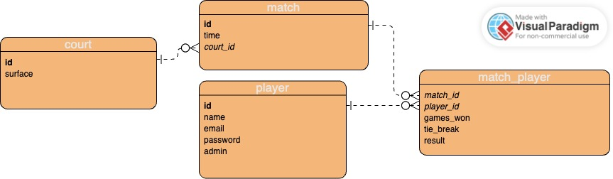
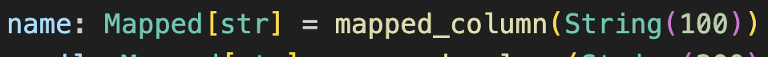
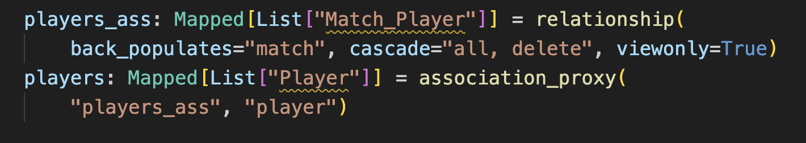

# T2A2 Tennis API Webserver

Jacob Smith

Note: Database queries in the API are documented in the docstrings of their respective functions. Docstrings use the google style guide as well as following PEP 8.

## R1

In the modern world, events are scheduled and organised online. Tennis matches should be no different. An API for tennis matches not only provides a convenient way to manage players, courts and matches, it also allows players to see detailed information about their match history. This API would allow matches of a one set format to be sceduled with a specific time, date and court and for results of the match to be recorded at the completion of the match. Players will use an email and password ensure the security of the site, with only admins being able to create, update and delete matches. Players will be able to view all matches not just their own, providing insight into the performance of their peers. If this API was combined with a front end it would be superior to a physical match organisation system in terms of data accessibility and overall convenience to the users.

## R2

I used Trello to track tasks during this APIs's development. Three lists were used to track each task: To do, Doing and Done. The first step of development was designing the database structure, after which the project could be mapped out. Displayed below is my Trello board midway through development. It shows my tasks and how I prioritised them.

You will notice that there are no tasks relating to testing. This is because testing was an ongoing process, being performed constantly as features were added.

## R3

### Postgresql

### Flask

### sqlAlchemy

psycopg2

### Marshmallow

### Bcrypt

### JWT

## R4

## R5

## R6

My ERD diagrams represent relationships with the symbols shown below. Additionally bold column names indicate a primary key and italicised names indicate a forein key.

My first attempt at modeling my database is shown below. I correctly separated the court surface and court id into its own entity with one court being able to be assigned to many matches. This prevents the surface value from being repeated in every match which would be unnecessary as it is derived from court id. The relationships between match and player however are not correctly normalised.

Below is my fully normalised database ERD. In the process of normalisation I realised that matchs and players must be represented by a many to many relationship as every match has two players and players can participate in multiple matches. The only way to model this in a relational database is with a join table. Both match and player have a one to many relationship with match player to facilitate the many to many relationship. The most logical place to store the data of games_won, tie_break and result is in the join table. As result (winner or loser) can be computed from the games_won values of two entities, an argument can be made that its inclusion does not follow normalisation principles. I believe it should be included as it prevents the value from being calculated each time it is needed and would make querying based on matches won easier.

## R7

The database is modeled in the Flask app using sqlAlchemy. Each entity is defined as a class with properties specifying each column in the entity. SqlAlchemy also allows Python data types to be mapped to Postgresql datatypes. An example is shown below.

The one to many relationships are created by importing and using sqlAlchemy's ForeignKey() function in a column definition. The relationship() function imported from sqlAlchemy allows queries to parent objects to directly return their associated objects. Direct access in the many to many relationship between match and player requires an sqlAlchemy feature called association proxy. This features allows the relationship to jump two hops, first to the join table and then again to the related table. A code example of what this looks like is shown below.

The back_populates keyword specifies a two way relationship, allowing direct access from both player and match to each other. The cascade keyword is used to ensure the associated entries in the join table are deleted when a match is deleted.

need more, need info about queries, maybe some of this should be in R5?

## R8
