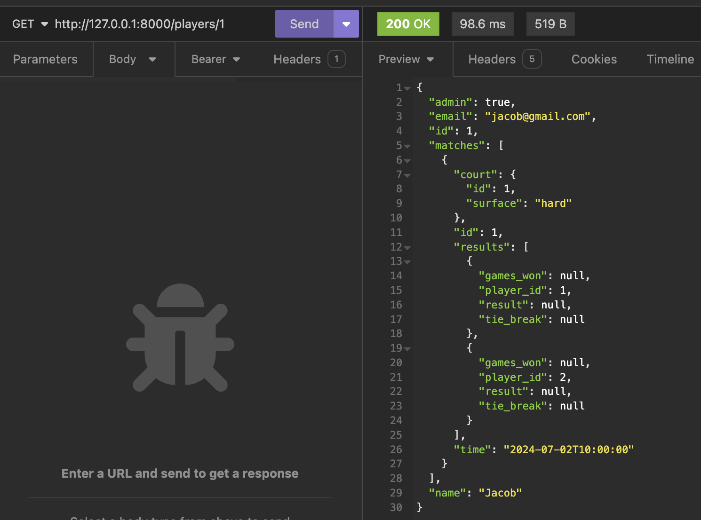

# T2A2 Tennis API Webserver

Jacob Smith

[GitHub Repo](https://github.com/intameli/T2A2-API-Webserver)

Note: Database queries in the API are documented in the docstrings of their respective functions. Docstrings use the google style guide as well as following PEP 8.

## R1

In the modern world, events are scheduled and organised online. Tennis matches should be no different. An API for tennis matches not only provides a convenient way to manage players, courts and matches, it also allows players to see detailed information about their match history. This API would allow matches of a one set format to be sceduled with a specific time, date and court and for results of the match to be recorded at the completion of the match. Players will use an email and password to ensure the security of the site, with only admins being able to create, update and delete matches. Players will be able to view all matches not just their own, providing insight into the performance of their peers. If this API was combined with a front end it would be superior to a physical match organisation system in terms of data accessibility and overall convenience to the users.

## R2

I used Trello to track tasks during this APIs's development. Three lists were used to track each task: To do, Doing and Done. The first step of development was designing the database structure, after which the project could be mapped out. Displayed below is my Trello board midway through development. It shows my tasks and how I prioritised them.


You will notice that there are no tasks relating to testing. This is because testing was an ongoing process, being performed constantly as features were added.

## R3

### Postgresql

PostgreSQL is an open-source relational database system. It is highly extensible and supports advanced data types. As a relational database it has robust data integrity and reliability and supports complex queries.

### Flask

Flask is a lightweight web framework for Python. It has minimal overhead and boiler-plate code, it is focused on its core functionality, leaving features such as object relational mapping to third-party libraries. Its features incude routing, templating and request handling. Flask is a popular choice in the industry, used by large and small companies.

### SQLAlchemy

SQLAlchemy is an Object-Relational Mapping (ORM) library for Python. It is the bridge between Flask and the database, allowing database entities to be operated on as Python objects. It is an abstraction on top of SQL queries and other database interactions, and it simplifies the creation of CRUD operations. Its powerful ability to create relationships between entities that simplify queries, make it one of the most popular ORMs.

### Marshmallow

The marshmallow docs describe it as: an ORM/ODM/framework-agnostic library for converting complex datatypes, such as objects, to and from native Python datatypes. As well as serialisation, it is also used in my API to validate and sanitise data. It enables features such as validating the length of a password.

### Bcrypt

Bcrypt is a library for hashing passwords so that they can be stored safely. Bcrypt uses a computationally intensive algorithm to make brute-force attacks more difficult.

### JWT

JWT (JSON Web Token) is an open standard for facilitating secure communication between two parties. JWTs use encription to ensure security. In my API a JWTs is returned from the login endpoint to be stored on device. The JWT can then be used to authenticate the user by providing it in the header of requests.

## R4

### PostgreSQL benefits

- PostgreSQL has full ACID compliance meaning it has good data integrity and reliability
- PostgreSQL supports complex queries such as joins, subqueries and set operations.
- As a relational database postgreSQL excels in managing highly structured data

### PostgreSQL drawbacks

- Potentially vunerable to SQL injections
- Relational databases don't have good support for hierachical data
- PostgreSQL can have performance overhead compared other options due to its strict ACID compliance

## R5

An Object Relational Mapper is software that allows the entities in a database to be interacted with as objects in an object-oriented language. It exists as an abstraction on top of the database and makes defining tables and querying easier for the developer. SQlAlchemy is the ORM used in this API. SQlAlchemy allows the tables in the database to be defined as Python objects. For example:

```python
class Player(db.Model):
    __tablename__ = "players"
    id: Mapped[int] = mapped_column(primary_key=True)
    name: Mapped[str] = mapped_column(String(100))
```

Additionally relationships can be defined between tables using the ForeignKey() function. The relationship() function allows direct access to resources in a linked table. The code below shows a one to many relationship.

```python
class Parent(Base):
    __tablename__ = "parent_table"

    id: Mapped[int] = mapped_column(primary_key=True)
    children: Mapped[List["Child"]] = relationship()


class Child(Base):
    __tablename__ = "child_table"

    id: Mapped[int] = mapped_column(primary_key=True)
    parent_id: Mapped[int] = mapped_column(ForeignKey("parent_table.id"))
```

SqlAlchemy is also used to query databases. Queries are generated in code and then executed. Shown below is SQLAlchemy's select function and the SQL statement it produces.

```python
from sqlalchemy import select
stmt = select([user_account.c.id, user_account.c.name]).where(user_account.c.name == 'spongebob')
```

is equivalent to

```
SELECT user_account.id, user_account.name
FROM user_account
WHERE user_account.name = 'spongebob';
```

to execute the statement the following code can be used

```python
result = session.execute(stmt)
```

To add rows to tables the following code can be used.

```python
db.session.add(Court(surface='grass'))
db.session.commit()
```

## R6

My ERD diagrams represent relationships with the symbols shown below. Additionally bold column names indicate a primary key and italicised names indicate a forein key.


My first attempt at modeling my database is shown below. I correctly separated the court surface and court id into its own entity with one court being able to be assigned to many matches. This prevents the surface value from being repeated in every match which would be unnecessary as it is derived from court id. The relationships between match and player however are not correctly normalised.


Below is my fully normalised database ERD. In the process of normalisation I realised that match and player must be represented by a many to many relationship as every match has two players and players can participate in multiple matches. The only way to model this in a relational database is with a join table. Both match and player have a one to many relationship with match_player to facilitate the many to many relationship. The most logical place to store the data of games_won, tie_break and result is in the join table. As result (winner or loser) can be computed from the games_won values of two entities, an argument can be made that its inclusion does not follow normalisation principles. I believe it should be included as it prevents the value from being calculated each time it is needed and would make querying based on matches won easier.


## R7

The database is modeled in the Flask app using sqlAlchemy. Each entity is defined as a class with properties specifying each column in the entity. SqlAlchemy also allows Python data types to be mapped to Postgresql datatypes. An example is shown below.


The one to many relationships are created by importing and using sqlAlchemy's ForeignKey() function in a column definition. The relationship() function imported from sqlAlchemy allows queries to parent objects to directly return their associated objects. Direct access in the many to many relationship between match and player requires an sqlAlchemy feature called association proxy. This features allows the relationship to jump two hops, first to the join table and then again to the related table. A code example of what this looks like is shown below.


The back_populates keyword specifies a two way relationship, allowing direct access from both player and match to each other. The cascade keyword is used to ensure the associated entries in the join table are deleted when a match is deleted.

Implementing the models using association proxy greatly simplifies the queries needed to get relevant data. A simle query such as:

```

stmt = db.select(Match)
matches = db.session.scalars(stmt).all()

```

is all that is required to get all matches each with a list of its players and its results. Similarly, the query:

```

stmt = db.select(Player)
players = db.session.scalars(stmt).all()

```

returns all players with the matches they have played and their corresponding results.

## R8

### /players

POST /players/login

This endpoint logs in a player and returns a JWT token. This is the only endpoint that does not require a JWT in the reqest to work. All requests after this one require a valid JWT to work. An example of what a JWT looks like can be seen in the response below.


One possible bad request is omiting the password which would return the following.

```
{
"error": {
    "password": [
        "Missing data for required field."
        ]
    }
}
```

POST /players

This request creates a new player. Email, name and password are required and admin is optional. If no admin is provided, the value is set to false by default. This request requires a JWT which is associated with an existing admin player to work.


The password must be atleast 6 characters long. If it isn't the following error will be returned.

```
{
    "error": {
        "password": [
            "Password must be at least 6 characters long"
        ]
    }
}
```

GET /players/id

This request returns a specific player by their id. It omits their password and includes their matches in the response. The JWT does not need to be associated with an admin for this request to work.



Providing an id which does not exist returns the following error.

```

{
    "error": "Not Found"
}

```

### /matches

POST /matches/

This endpoint creates a match. Only admins can use this endpoint. All fields must be provided. The result of the match is not provided in the body of the request as this endpoint is for creating matches to be played in the future. The results are updated later once the match has been played.


DELETE /matches/id

This endpoint deletes a match with the provided id. Only admins are authorised to do this. The entries that relate to the match in the match_player join table are also deleted.


PATCH/PUT /matches/id

This endpoint updates a match. Only the columns you want updated need to be provided. This endpoint is only avaiable to admins.


GET /matches/id

This endpoint returns one match from its id including a list of the players associated and the results. Admin is not required, only a valid JWT.


GET /matches

This endpoint returns all matches in the database. Admin is not required, only a valid JWT.


```

```
